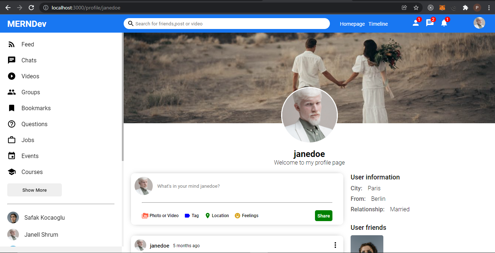

# Aocial Media App V2
Social media application using MERN stack and real time communication using socket.io

## Features

- Share your favourite post.
- Chat with your favourite ones using  socket.io technology.
- Follow and unfollow users.
- Allows the followed ones to like and comment your posts.

## Tech

This application uses a number of open source projects to work properly:

- [Node.js] - Node.js is an open-source, cross-platform, back-end JavaScript runtime environment that runs on the V8 engine and executes JavaScript code outside a web browser.
- [Express] -  Express.js is a back end web application framework for Node.js. It is designed for building web applications and APIs. 
- [React.js] - JSON Web Token is a proposed Internet standard for creating data with optional signature and/or optional encryption whose payload holds JSON that asserts some number of claims.
- [Socket.io] - JSON Web Token is a proposed Internet standard for creating data with optional signature and/or optional encryption whose payload holds JSON that asserts some number of claims.
- [JWT] - JSON Web Token is a proposed Internet standard for creating data with optional signature and/or optional encryption whose payload holds JSON that asserts some number of claims.
- [MongoDB] - JSON Web Token is a proposed Internet standard for creating data with optional signature and/or optional encryption whose payload holds JSON that asserts some number of claims.

And of course this application itself is open source with every code available here in github.

## Installation

Requires [Node.js](https://nodejs.org/) v10+ to run.

Install the dependencies and start the server.

### Backend
```sh
cd api
npm install
npm run index.js
```

### Frontend
```sh
cd client
npm install
npm run start
```

## Screenshot

##### Home Page


##### Profile Page


##### Messenger Page


##### Chat page


## Development

Want to contribute? Great!

This application uses MERN stack for fast developing.
Make a change in your file and instantaneously see your updates!

The application requires a few environment variables such as
##### Backend
- [MONGO_URI] - Cloud database URI

##### Frontend
- [REACT_APP_PUBLIC_FOLDER] - Folder in which the images are getting store. By default it is using 'http://localhost:5000/images/'

## Note

- Need to provide environment variables in both api and client folder to run the application.The mandatory environment variables are mentioned in the development section.

<!-- ## License

MIT -->


